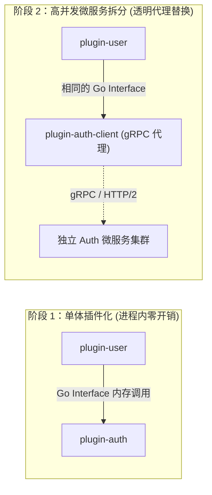

# WAVELET 架构白皮书 (Technical Architecture White Paper)

- **版本**: v1.0.0 (Cordis Architecture Standard)
- **代号**: Cordis-Wavelet
- **编写组织**: Wavelet 核心架构委员会
- **发布日期**: 2026-08-27

---

## 1. 摘要与愿景 (Executive Summary)

Wavelet 是面向下一代云原生与企业级业务中台的 **微内核全插件化框架 (Micro-Kernel & Plugin-Native Platform)**。
其核心愿景是：**通过极致内聚的微内核与纯净的上下文服务总线，实现“一切皆插件、一切皆服务”的极高业务拓展性与生态繁荣**。

无论是一线工程师开发单个轻量业务功能，还是大型企业面向数万 QPS 高并发流量进行微服务拆分，Wavelet 均能以统一的开发范式支撑未来 5 年的平滑演进。

---

## 2. 核心架构哲学 (Core Architectural Philosophy)

```
                     ┌────────────────────────┐
                     │    Context (上下文)    │
                     │  (统一服务总线/IoC Hub) │
                     └───────────┬────────────┘
                                 │
         ┌───────────────────────┼───────────────────────┐
         ▼                       ▼                       ▼
   [提供服务 Provide]       [依赖服务 Using]       [扩展能力 Extend]
   ctx.Provide(Auth)      ctx.Using([DB, Cache])    ctx.Route / ctx.Task
```

### 2.1 微内核原则 (Micro-Kernel Principle)
内核（`core/`）不持有任何具体业务逻辑，不硬编码 Gin、GORM、Asynq 等具体引擎。内核仅提供：
- 树状上下文（`Context`）与作用域隔离（`Fork`）
- 泛型依赖注入与服务定位器（`IoC Container`）
- 强类型领域事件总线（`EventBus`）
- 生命周期编排器（`Lifecycle Manager`）与标准扩展点契约

### 2.2 扁平自包含插件 (Flat & Self-Contained Plugins)
告别过度设计的 DDD 样板代码，每个插件作为一个自给自足的高内聚闭包，就近组织路由、Handler、模型与专属数据迁移，实现**随插随用、按需组合、随拔随走**。

### 2.3 编译期依赖组合 (Compile-Time Composition)
基于 Go 语言的静态强类型优势，下游项目通过 `app.Use(&MyPlugin{})` 在编译期静态组装，产出单一静态二进制文件，兼具极高运行性能与极低运维分发成本。

---

## 3. 架构全景模型 (Architecture Landscape)

```
+-----------------------------------------------------------------------------------+
|                        下游业务项目 (Downstream Application)                       |
|           main.go: app.Use(&logger.Plugin{}).Use(&auth.Plugin{})...               |
+-----------------------------------------------------------------------------------+
                                         │
                                         ▼
+-----------------------------------------------------------------------------------+
|                       Wavelet Core (微内核上下文总线)                              |
|   - Context (服务树与扩展点总线)          - Lifecycle Manager (生命周期编排)     |
|   - Service Hub (泛型 IoC 容器)           - EventBus (强类型领域事件总线)        |
+-----------------------------------------------------------------------------------+
         │                                       │
         ▼ 注册与驱动                            ▼ 挂载能力
+------------------------------------+  +-------------------------------------------+
|    运行时驱动插件 (Driver Plugins)  |  |       业务领域插件 (Domain Plugins)       |
|  - driver-http (Gin Web 引擎)      |  |  - plugin-auth (认证/Session/OAuth)       |
|  - driver-worker (Asynq 消费池)     |  |  - plugin-user (用户资料/角色权限)        |
|  - driver-cron (Asynq 定时调度器)  |  |  - plugin-msg-gateway (消息通道与推送)    |
|  - driver-database (GORM 数据源)   |  |  - plugin-risk-control (访问风控与限流)   |
|  - driver-cache (RAM/Redis 缓存)   |  |  - [下游自定义插件] (业务私有插件)        |
+------------------------------------+  +-------------------------------------------+
```

---

## 4. 高并发与分布式演进路线 (Scalability & Microservices Strategy)



1. **接口不变性原则 (Contract Immutability)**：跨插件交互全部面向 `core/contracts` 纯接口。微服务拆分时仅需引入 gRPC 客户端插件，调用方业务代码 **0 修改**。
2. **分布式事件网格 (Event Mesh)**：内存 EventBus 支持无缝升级为 Redis Stream / NATS / Kafka 分布式总线。
3. **数据分片与独立演进**：每个插件自包含 Goose SQL 迁移与独立表前缀，天然支持主从分库与分库分表。

---

## 5. 核心建设与里程碑 (Milestones)

| 阶段 | 里程碑目标 | 交付物 | 状态 |
| :--- | :--- | :--- | :--- |
| **Phase 1** | 微内核 Context 与泛型 IoC 容器 | `core/context.go`, `core/container.go` | ✅ 已完成 (96.2% 单测) |
| **Phase 2** | 领域扩展点与强类型 EventBus | `core/extpoints/`, `core/events.go` | ✅ 已完成 (97.1% 单测) |
| **Phase 3** | 运行时驱动插件下沉 (HTTP/Worker/Cron) | `plugins/drivers/*` | ✅ 已完成 (生命周期单测) |
| **Phase 4** | 基础设施服务插件化 (DB/Cache/Log/Storage) | `plugins/infra/*` | 🟡 构建中 |
| **Phase 5** | 业务领域模块插件化解耦 (Auth/User/Msg/Admin) | `plugins/domain/*` | ⚪ 待构建 |
| **Phase 6** | CLI 运行时切面调度与 App 编排器 | `core/app.go`, `cmd/*` | ⚪ 待构建 |
| **Phase 7** | 下游开发者脚手架与全链路 E2E 验证 | `downstream/*` | ⚪ 待构建 |

