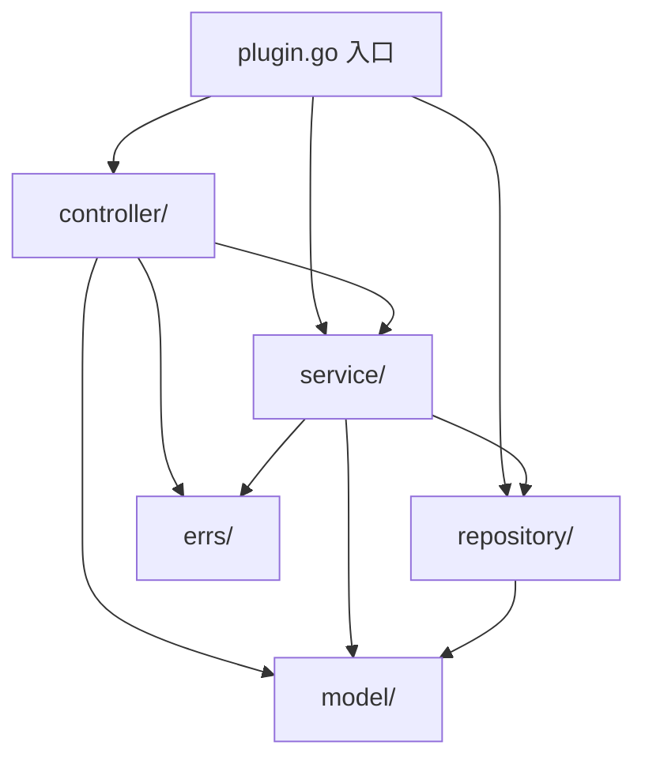

# Cordis 架构插件标准分层设计规范 (Plugin Layered Architecture Spec)

- **文档状态**: 已敲定 (Approved)
- **版本**: v1.0.0 (2026-08-28)
- **适用范围**: Wavelet 官方插件 (`backend/plugins/`)、下游定制插件 (`downstream/custom_plugins/`)

---

## 1. 架构总览与分型原则 (Architecture & Selection Strategy)

在 Wavelet 的 Cordis 微内核架构中，系统通过 **微内核 (`core/`) + 服务契约 (`core/contracts/`) + 自包含插件 (`plugins/`)** 实现高度解耦与单向依赖。
为了规范插件内部代码组织，插件遵循 **标准分层架构（Layered Architecture / MVC 变体）**，并根据业务复杂度提供两套标准物理包结构：

| 模式 | 适用场景 | 复杂度特征 | 物理结构形式 |
| :--- | :--- | :--- | :--- |
| **模式 1：扁平自包含分层**<br>(Flat Self-Contained) | 简单逻辑插件（推荐默认） | 代码量 < 3000 行、单聚合根、单一职责（如 `upload`, `cap`, `system`） | 单 Go package，文件级划分职责 |
| **模式 2：严格子包分层**<br>(Strict Sub-packages) | 复杂业务插件 | 代码量 ≥ 3000 行、多聚合根、状态机流转复杂（如大型 `auth`, `order/billing`, `admin`） | 多 Go package，目录级物理隔离 |

---

## 2. 模式 1：扁平自包含分层规范 (Flat Self-Contained Package)

适合中小型或单一功能插件。所有代码位于同个 package（如 `package order`），彻底避免 Go 子包循环导入。

### 2.1 目录结构
```text
backend/plugins/domain/<plugin_name>/
├── plugin.go           # [Cordis 接入层] 实现 core.Plugin，负责 Apply 组装、依赖注入与扩展点注册
├── handlers.go         # [Controller 层] Gin API Handler：参数校验、认证上下文提取、信封响应 (response.OK/Abort)
├── service.go          # [Service 层] 核心业务用例、事务编排、事件触发 (ctx.Events().Emit)，入参仅为 context.Context
├── repository.go       # [Repository 层] 数据持久化层：GORM / DB 操作、SQL 防注入与转义
├── models.go           # [Model 层] 数据表映射模型 (GORM)、入参/出参 DTO、请求响应结构体
├── errs.go             # [Error 层] 模块内专用错误常量 (camelCase 字符串)
├── plugin_test.go      # 插件单元与集成测试
└── migrations/         # [Migration 层] 专属 Goose SQL 嵌入文件 (//go:embed)
    └── 20260828000001_init_<plugin_name>.sql
```

### 2.2 横向文件扩展
当某一职责文件变大时，按语义横向拆分（仍在同一 package 内）：
- `handlers_admin.go`, `handlers_user.go`
- `models_dto.go`, `models_entity.go`

---

## 3. 模式 2：严格子包分层规范 (Strict Sub-package Architecture)

适合重型业务插件，通过 Go package 物理隔离强制依赖方向（`controller -> service -> repository -> model`）。

### 3.1 目录结构
```text
backend/plugins/domain/<plugin_name>/
├── plugin.go              # [插件根入口] 实现 core.Plugin，装配各子包并向 Cordis 注册
├── controller/            # package controller：HTTP API Handler
│   ├── http.go            # Gin 请求参数校验与信封响应
│   └── router.go          # 路由映射与中间件挂载函数
├── service/               # package service：核心业务逻辑
│   ├── service.go         # 业务接口定义 (Service Interface)
│   └── service_impl.go    # 业务接口实现 (ServiceImpl)
├── repository/            # package repository：数据持久化访问层
│   ├── repository.go      # 仓储接口定义 (Repository Interface)
│   └── repository_impl.go # GORM 数据持久化实现
├── model/                 # package model：纯实体与 DTO（无外部依赖）
│   ├── entity.go          # 数据库映射实体 (TableName 带插件前缀)
│   └── dto.go             # 请求与响应 DTO
├── errs/                  # package errs：错误常量与错误码定义
│   └── errs.go
└── migrations/            # Goose SQL 独立迁移嵌入文件
    └── 20260828000001_init_<plugin_name>.sql
```

### 3.2 依赖方向约束 (Strict Dependency Flow)

* **禁止反向依赖**：`repository` 严禁依赖 `service` 或 `controller`；`service` 严禁依赖 `controller`；`model` 严禁依赖任何上层包。

---

## 4. 各层职责边界与编码守则 (Layer Responsibilities & Guardrails)

### 4.1 Controller / Handler 层 (接入层)
1. **参数绑定**：使用 `c.ShouldBindJSON` 或 `c.ShouldBindQuery`。
2. **上下文提取**：从 `*gin.Context` 提取登录态（如 `oauth.GetCurrentUser(c)`）。
3. **调用下游**：调用 Service 方法，禁止直接调用 Repository 或编写 SQL。
4. **统一信封响应**：
   - 成功：`c.JSON(http.StatusOK, response.OK(data))` 或 `response.OKNil()`。
   - 失败：使用 `backend/pkg/response` 的 `Abort*` 系列函数（如 `AbortBadRequest`、`AbortUnauthorized`、`AbortNotFound`、`AbortInternal`）。
5. **Swagger 注释**：每个导出 Handler 必须编写完整的 OpenAPI/Swagger 注解。

### 4.2 Service 层 (业务用例层)
1. **纯 Go 逻辑**：第一参数必须为 `ctx context.Context`，返回 `(result, error)`。
2. **禁止依赖 Web 框架**：严禁 import `github.com/gin-gonic/gin`，严禁接收 `*gin.Context`，严禁调用 `c.JSON`/`Abort*`。
3. **事务编排**：涉及插件内多表原子操作时，通过 `ctx.DB().Transaction(...)` 编排。
4. **事件驱动解耦**：跨插件业务通知与状态联动统一通过 `ctx.Events().Emit(...)` 广播领域事件，杜绝直接跨插件调用私有方法。

### 4.3 Repository 层 (持久化访问层)
1. **GORM / SQL 操作**：统一接收 `context.Context`，通过 `db.WithContext(ctx)` 操作数据。
2. **SQL LIKE 防注入**：所有含用户输入的模糊查询必须调用 `backend/pkg/util.EscapeLike` 并显式声明 `ESCAPE '\\'`。
3. **表单一所有者原则**：仅操作本插件所属表（前缀 `w_<plugin>_*`），严禁越权 DML/DDL 其他插件所有表。

### 4.4 Model 层 (实体与 DTO 层)
1. **GORM 映射**：显式实现 `TableName() string` 返回带前缀表名。
2. **零值对齐**：Go 结构体字段零值必须与数据库默认值匹配。
3. **无物理外键**：禁止物理外键约束，显式建立单列/复合索引。

### 4.5 Plugin 入口 (Cordis 生命周期与装配)
1. 实现 `core.Plugin` 接口（`Name() string` 与 `Apply(ctx *core.Context) error`）。
2. 在 `Apply` 中完成：
   - 依赖注入与解析（`core.Provide` / `core.Inject` / `ctx.Using`）
   - 路由与中间件声明（`ctx.Router().Group(...)`）
   - 异步与定时任务注册（`ctx.Task().Register` / `ctx.Schedule().RegisterCron`）
   - 配置与设置声明（`ctx.Settings().Register` / `ctx.Config().Bind`）
   - 数据库迁移注册（`ctx.Migrations().Register`）
